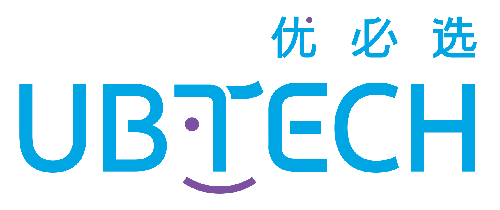

# 你好，我们是优必选 👋 

*人形机器人的领导者和智能服务机器人领航企业*

优必选科技创立于2012年3月，是人形机器人的领导者和智能服务机器人的领航企业。我们始终秉持“让智能机器人走进千家万户，让人类的生活方式变得更加便捷化、智能化、人性化”的使命。

优必选聚焦工业制造、商用服务、家庭陪伴三大场景，凭借人形机器人全栈式技术能力，推出了“硬件+软件+服务+运营”一体化的智能服务机器人解决方案，致力于以创新科技回应社会重大需求，创造可持续发展的社会价值。

 

 
 
 
 
 

# 加入我们的开源社区！
无论您来自学术界、工业界，还是是热爱机器人的个人开发者，我们都诚邀您参与优必选的具身智能开源项目。您的每一份贡献都将推动人形机器人技术走向更广阔的应用。

🤝 如何参与？

- **探索与贡献**
  欢迎深入了解我们的代码库并实践体验。若您在使用过程中发现任何问题，欢迎提交 Issue；若能进一步通过 Pull Request 修复问题或贡献新功能，我们将表示由衷的感谢！
- **分享您的实践**
  撰写技术文章、教程或案例，分享您在人形机器人、视觉语言动作模型（VLA）、仿真部署等方面的实践经验。您的知识将帮助更多开发者加入具身智能的生态。
- **携手合作**
  无论您来自高校、研究机构或企业，欢迎提出合作构想——无论是联合研发、场景落地，还是技术共建，我们都期待与您深入交流！

# 开源活动
以下是我们社区最新的开源活动——敬请关注！ 🚀

# 代码库

| Title | Description |
| :--- | :--- |
| [Thinker](https://github.com/UBTECH-Robot/Thinker) | 一款专为具身智能打造的尖端视觉语言基础模型，旨在弥合通用场景理解与稳健机器人任务能力之间的鸿沟。Thinker在任务规划、视觉定位和空间理解三大领域创下7项具身AI基准测试新纪录，显著超越现有开源、闭源及专用基线模型，展现出作为具身智能与自主机器人决策基础架构的巨大潜力。 |
| [TienKung-Lab](https://github.com/UBTECH-Robot/TienKung-Lab) | 本项目是一个基于强化学习（RL）的运动控制系统，适用于全尺寸人形机器人天工行者。它将 AMP 风格的奖励与周期性步态奖励相结合，促进了自然、稳定和高效的行走和跑步行为。该框架已在真机得到成功验证。 |
| [x-humanoid-training-toolchain](https://github.com/UBTECH-Robot/x-humanoid-training-toolchain) | 本项目是天工行者机器人对于 Lerobot 开源框架适配的训练工具链。使用此项目，用户可以基于 Lerobot 开源框架的算法实现天工行者机器人的具身操作。 |
| [Deploy_Tienkung](https://github.com/UBTECH-Robot/Deploy_Tienkung) | 天工行者人形机器人强化学习控制项目集，包含了天工行者系列人形机器人强化学习控制系统的主要组件。 |

# 联系我们
- developer@ubtrobot.com

# 开发者社区

